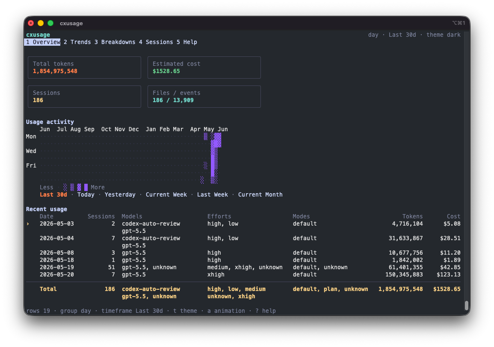
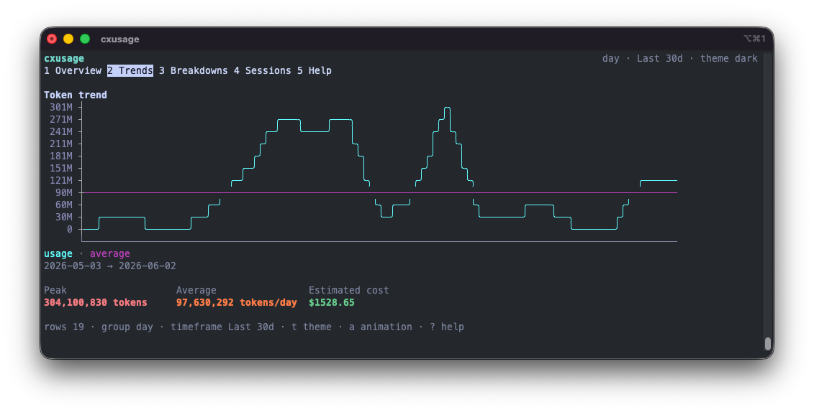
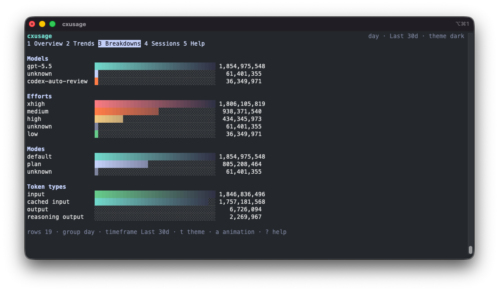
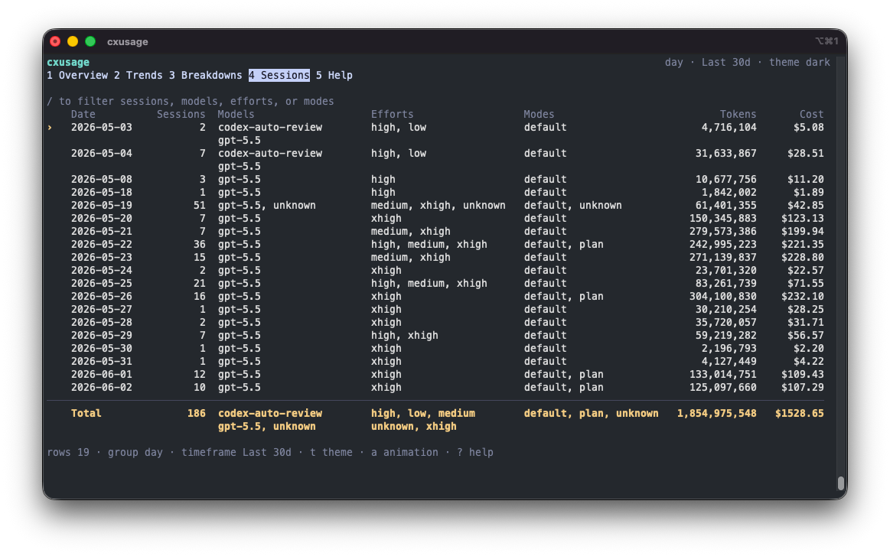

# cxusage

[](https://github.com/hashmil/cxusage/actions/workflows/build.yml)
[](https://github.com/hashmil/cxusage/actions/workflows/release.yml)

Interactive local Codex usage explorer for the terminal.

`cxusage` scans local Codex session logs and shows token usage, model/effort/mode breakdowns, terminal charts, and estimated cost. It is local-only: no network calls, no telemetry, and no cloud account access.

This is an unofficial open source tool for enterprise Codex users who can run Codex locally but cannot use cloud Codex because it is not enabled, approved, or available in their environment. It gives teams a local way to understand usage from the logs that already exist on their machine.

## Screenshots

| Overview | Trends |
| --- | --- |
|  |  |
| KPI cards, yearly activity heatmap, and recent usage in one terminal view. | Token trend chart with usage, average line, peak, average, and estimated cost. |

| Breakdowns | Sessions |
| --- | --- |
|  |  |
| Model, effort, mode, and token-type breakdowns with compact terminal bars. | Borderless ledger table for sessions, models, efforts, modes, tokens, and cost. |

## Features

- Interactive Bubble Tea TUI by default
- Overview, trends, breakdowns, sessions, and help views
- Dark, light, and auto theme detection on macOS
- Terminal-width-aware rendering with compact fallback
- Multi-line model, effort, and mode cells
- Single terminal chart view with compact axis labels
- JSON output for scripts
- Default timeframe: last 30 days
- Presets for today, week, month, current year, and all time
- Estimated cost column using model-specific OpenAI pricing constants where the local logs expose a known model

## Who It Is For

`cxusage` is useful when:

- Your organization permits local Codex usage but has not enabled cloud Codex.
- You need local visibility into sessions, token usage, model/effort/mode mix, and rough cost.
- You cannot rely on a hosted dashboard because of enterprise policy, network limits, or rollout timing.
- You want a private, offline-first usage viewer that reads only local `~/.codex` logs.

## Install

There are three practical ways to install `cxusage`.

### Option 1: Go Install

Use this if you already have Go 1.25 or newer installed.

```sh
go install github.com/hashmil/cxusage/cmd/cxusage@latest
```

Go installs the binary into `$(go env GOPATH)/bin`, which is usually `~/go/bin`.

If `~/go/bin` is already on your `PATH`, run:

```sh
cxusage
```

If it is not on your `PATH`, run it directly:

```sh
~/go/bin/cxusage
```

To make `cxusage` available from any terminal, add Go's bin directory to your shell profile.

For zsh:

```sh
echo 'export PATH="$HOME/go/bin:$PATH"' >> ~/.zshrc
source ~/.zshrc
```

For bash:

```sh
echo 'export PATH="$HOME/go/bin:$PATH"' >> ~/.bashrc
source ~/.bashrc
```

Then run:

```sh
cxusage
```

### Option 2: Clone And Build From Source

Use this if you want to inspect or modify the source locally.

```sh
git clone https://github.com/hashmil/cxusage.git
cd cxusage
go install ./cmd/cxusage
```

Or build a binary in the repo:

```sh
go build -o bin/cxusage ./cmd/cxusage
./bin/cxusage
```

### Option 3: Download A Prebuilt Binary

Use this if you do not want to install Go.

Download the latest release asset for your platform:

- [Apple Silicon Mac](https://github.com/hashmil/cxusage/releases/latest/download/cxusage-darwin-arm64)
- [Linux Intel/AMD](https://github.com/hashmil/cxusage/releases/latest/download/cxusage-linux-amd64)
- [Linux ARM](https://github.com/hashmil/cxusage/releases/latest/download/cxusage-linux-arm64)
- [Windows Intel/AMD](https://github.com/hashmil/cxusage/releases/latest/download/cxusage-windows-amd64.exe)

On macOS or Linux, move the binary into a directory on your `PATH`:

```sh
chmod +x ./cxusage-darwin-arm64
mkdir -p ~/.local/bin
mv ./cxusage-darwin-arm64 ~/.local/bin/cxusage
```

Replace `cxusage-darwin-arm64` with the Linux filename if you downloaded a Linux binary.

For zsh:

```sh
echo 'export PATH="$HOME/.local/bin:$PATH"' >> ~/.zshrc
source ~/.zshrc
cxusage
```

For bash:

```sh
echo 'export PATH="$HOME/.local/bin:$PATH"' >> ~/.bashrc
source ~/.bashrc
cxusage
```

On Windows PowerShell, run:

```powershell
.\cxusage-windows-amd64.exe
```

For regular Windows use, rename it to `cxusage.exe`, then move it into a folder that is already on your `PATH`, or add its folder to your user `PATH`.

### Updating An Existing Install

If you installed with `go install`, run the same command again:

```sh
go install github.com/hashmil/cxusage/cmd/cxusage@latest
```

If your shell still shows an older version, confirm which binary is being used:

```sh
which cxusage
```

Make sure the shown directory is the same one Go installs to:

```sh
go env GOPATH
```

Go usually installs to `$(go env GOPATH)/bin`, for example `~/go/bin/cxusage`.

If you cloned the repo, pull and reinstall:

```sh
cd cxusage
git pull
go install ./cmd/cxusage
```

If you downloaded a prebuilt binary, download the latest release asset for your platform and replace the old `cxusage` binary on your `PATH`.

## Usage

Launch the interactive TUI:

```sh
cxusage
```

Show JSON for the last 7 days:

```sh
cxusage --json --last 7d
```

Group by model and effort:

```sh
cxusage --group-by model-effort
```

Use a custom Codex home:

```sh
cxusage --codex-home /path/to/.codex
```

Force a theme:

```sh
cxusage --theme light
cxusage --theme dark
cxusage --theme auto
```

Disable color or animation:

```sh
cxusage --no-color
cxusage --no-animation
```

## Flags

```text
--last 30d           relative range; supports h, d, w, m
--today              today only
--yesterday          yesterday only
--week               current week
--last-week          previous week
--month              current month
--year               current year
--current-year       current year
--all                all available local logs
--all-time           all available local logs
--since YYYY-MM-DD   custom start date
--until YYYY-MM-DD   custom end date, inclusive
--group-by VALUE     day, week, month, session, model, effort, mode, model-effort
--json               print JSON instead of launching the TUI
--theme VALUE        auto, dark, or light
--no-color           disable color styling
--no-animation       disable spinner and count-up animation
--codex-home PATH    defaults to ~/.codex
```

## TUI Keys

```text
q / ctrl+c   quit
r            refresh logs
1-5          switch views
left/right   switch views
j/k          move selection
f            cycle timeframe
g            cycle grouping
/            filter rows
a            toggle animation
t            toggle dark/light theme
?            help
```

## What It Reads

`cxusage` reads:

```text
~/.codex/sessions
~/.codex/archived_sessions
```

It looks for `rollout-*.jsonl` files, deduplicates active and archived copies by session id, computes token deltas from cumulative `token_count.total_token_usage` records, and attributes each token delta to the latest preceding `turn_context`.

Model, reasoning effort, and collaboration mode are shown when they are present in the local logs. Service tier is intentionally omitted because historical local logs do not reliably expose it.

## Cost Estimate

The cost number is only an estimate. `cxusage` uses the model name in each local `turn_context` record when it is available, then applies standard short-context OpenAI API token rates. Unknown model names fall back to GPT-5.5 rates so older behavior stays conservative.

| Model family | Input / 1M | Cached input / 1M | Output / 1M |
| --- | ---: | ---: | ---: |
| `gpt-5.5` | $5.00 | $0.50 | $30.00 |
| `gpt-5.4` | $2.50 | $0.25 | $15.00 |
| `gpt-5.4-mini` | $0.75 | $0.075 | $4.50 |
| `gpt-5.4-nano` | $0.20 | $0.02 | $1.25 |
| `gpt-5.2`, `gpt-5.2-codex` | $1.75 | $0.175 | $14.00 |
| `gpt-5.1`, `gpt-5`, `gpt-5-codex` | $1.25 | $0.125 | $10.00 |
| `gpt-5-mini`, `gpt-5.1-codex-mini` | $0.25 | $0.025 | $2.00 |
| `gpt-5-nano` | $0.05 | $0.005 | $0.40 |
| `codex-mini-latest` | $1.50 | $0.375 | $6.00 |
| `gpt-4.1` | $2.00 | $0.50 | $8.00 |
| `gpt-4.1-mini` | $0.40 | $0.10 | $1.60 |
| `gpt-4o` | $2.50 | $1.25 | $10.00 |
| `gpt-4o-mini` | $0.15 | $0.075 | $0.60 |

Reasoning output tokens are shown separately, but cost is estimated from the output token total available in the logs. Service tier, long-context, regional processing, batch, flex, and priority uplifts are intentionally omitted because local historical logs do not reliably expose them. See [OpenAI API pricing](https://openai.com/api/pricing/) and the [detailed pricing docs](https://developers.openai.com/api/docs/pricing) for current official rates.

## Development

```sh
go test ./...
go vet ./...
go build -o bin/cxusage ./cmd/cxusage
```

Run against fixture data:

```sh
cxusage --codex-home ./testdata/codex-home --json
```

## GitHub Actions

The repository includes two workflows:

`Build` runs on pushes to `main`, pull requests, and manual dispatches. It:

- installs the Go version declared in `go.mod`
- runs `go test ./...`
- runs `go vet ./...`
- builds `./cmd/cxusage`
- uploads per-run platform binaries as workflow artifacts

`Release` runs when a `v*` tag is pushed. It:

- runs the same tests and vet checks
- creates or updates the GitHub release for the tag
- uploads stable release assets used by the download links above

## Privacy

`cxusage` is a local CLI. It does not send usage data anywhere. JSON output can include local session-derived metadata, so treat exported files as private unless you have reviewed them.
